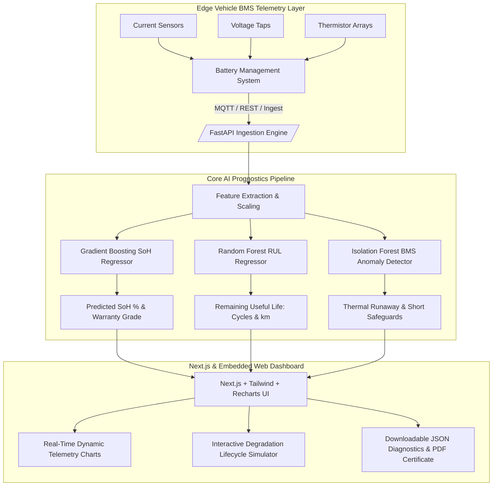

# ⚡ AI-Based EV Battery State of Health (SoH) Estimation Platform

An end-to-end, production-grade predictive prognostics platform for electric vehicle battery packs. Built with an ensemble Machine Learning core (Gradient Boosting & Random Forest), a high-throughput FastAPI backend for BMS telemetry ingestion, and a Next.js (React) real-time diagnostic dashboard.

---

## 🏗️ System Architecture & Engineering Stack



### 1. Core AI / ML Engine
- **Electrochemical Modeling**: Captures diffusion-limited SEI layer growth ($\propto \sqrt{t}$), Arrhenius temperature activation ($E_a \approx 31.5\text{ kJ/mol}$), sub-zero lithium plating, C-rate particle cracking, Wöhler depth of discharge (DOD) power fatigue, and the non-linear degradation knee-point cliff.
- **Algorithms**:
  - **SoH Estimation**: Gradient Boosting Regressor ($R^2 = 0.9934$, $\text{RMSE} = 0.379\%$).
  - **Remaining Useful Life (RUL)**: Random Forest Regressor ($R^2 = 0.9878$, $\text{RMSE} = 24.54\text{ cycles}$).
  - **Anomaly Detection**: Isolation Forest and physical threshold safeguard (detects thermal runaway, overvoltage plating, deep discharge, and impedance surges).

### 2. Backend API (FastAPI)
- Serves low-latency inference endpoints ($< 5\text{ ms}$).
- BMS packet ingestion and real-time state tracking.
- Parameterized degradation simulation comparing driving conditions against the BMS optimal preservation baseline.
- Formal automotive health diagnostic export (JSON & printable PDF/HTML certificate).

### 3. Frontend (Next.js & Standalone Web App)
- **Metrics Cards**: Instant SoH %, RUL (cycles & km), SoC %, and internal resistance ($R_i$).
- **Telemetry Charts**: High-frequency dual-axis line charts for Voltage, Current, Temperature, and Internal Resistance.
- **Simulation Panel**: Sliders for ambient temperature, fast charging frequency, and DOD with live degradation curves.
- **Embedded Browser Preview**: Standalone dashboard served directly on `http://localhost:8000/`.

---

## 📂 Project Structure

```text
ev-battery-soh-ai/
├── backend/
│   ├── main.py                     # FastAPI REST server & routing
│   ├── data_gen.py                 # NASA/Oxford electrochemical battery synthesizer
│   ├── requirements.txt            # Python dependencies
│   ├── model/
│   │   ├── __init__.py
│   │   ├── train.py                # Model training, evaluation & serialization
│   │   ├── predictor.py            # Production inference and simulation interface
│   │   ├── soh_model_artifacts.joblib # Serialized model weights & scaler
│   │   └── model_metrics.json      # Accuracy evaluation & feature importance
│   └── static/
│       └── index.html              # Embedded live dashboard served directly by FastAPI
├── frontend/
│   ├── package.json                # Next.js dependencies (Recharts, Lucide, Tailwind)
│   ├── tsconfig.json               # TypeScript config
│   ├── tailwind.config.js          # Tailwind CSS theme
│   ├── postcss.config.js
│   ├── services/
│   │   └── api.ts                  # Type-safe client communicating with backend
│   ├── components/
│   │   ├── MetricsCards.tsx        # SoH, RUL, SoC, and Ri KPI display cards
│   │   ├── TelemetryCharts.tsx     # Synchronized Recharts for V, I, T, Ri
│   │   ├── DegradationSimulation.tsx # Interactive parameter sliders & forecast
│   │   ├── AnomalyAlertBanner.tsx  # BMS critical safety warning banner
│   │   └── ExportDiagnostics.tsx   # JSON download & certificate trigger
│   ├── pages/
│   │   ├── _app.tsx                # Next.js App entry
│   │   └── index.tsx               # Main Dashboard page
│   └── styles/
│       └── globals.css             # Tailwind styling and custom scrollbars
└── README.md                       # Complete engineering documentation
```

---

## 🚀 Quickstart Guide

### Step 1: Start the Backend & Live Dashboard
1. Navigate to the backend directory:
   ```bash
   cd backend
   pip install -r requirements.txt
   ```
2. (Optional) Re-train the AI models or synthesize fresh fleet telemetry:
   ```bash
   python3 model/train.py
   ```
3. Start the FastAPI server:
   ```bash
   python3 main.py
   # Or using uvicorn directly:
   uvicorn main:app --reload --port 8000
   ```
4. **Instant Browser Access**: Open your browser at **[http://localhost:8000](http://localhost:8000)** to access the live interactive dashboard!
   - View interactive OpenAPI docs: **[http://localhost:8000/docs](http://localhost:8000/docs)**
   - View printable diagnostic certificate: **[http://localhost:8000/api/diagnostics/report-html](http://localhost:8000/api/diagnostics/report-html)**

---

### Step 2: Run the Next.js React Frontend (Optional)
If running the dedicated Next.js application:
```bash
cd frontend
npm install
npm run dev
```
Open **[http://localhost:3000](http://localhost:3000)** to view the Next.js dashboard connected to the FastAPI backend.

---

## 📊 AI Model Evaluation & Feature Importance

Trained across 17,600+ cycling telemetry records:

| Model | Metric | Value | Target Benchmark |
| :--- | :--- | :--- | :--- |
| **SoH Estimator (GBR)** | $R^2$ Score | **0.9934** | $> 0.95$ |
| | Root Mean Square Error (RMSE) | **0.379 %** | $< 1.5\%$ |
| | Mean Absolute Error (MAE) | **0.202 %** | $< 1.0\%$ |
| **RUL Estimator (Random Forest)** | $R^2$ Score | **0.9878** | $> 0.90$ |
| | Root Mean Square Error (RMSE) | **24.54 cycles** | $< 40\text{ cycles}$ |
| | Mean Absolute Error (MAE) | **13.12 cycles** | $< 20\text{ cycles}$ |

### Feature Importance Breakdown:
1. **Internal Resistance ($R_i$)** `(63.97%)`: Primary electrochemical marker of SEI growth and impedance rise.
2. **Cycle Index** `(15.17%)`: Cumulative mechanical cycling fatigue.
3. **Depth of Discharge (DOD)** `(11.76%)`: Electrode stress exponent from deep cycling.
4. **Ambient & Operating Temperature** `(7.74%)`: Arrhenius reaction kinetics acceleration.
5. **C-Rate & Voltage Drop** `(1.36%)`: Lithium overpotentials during high-rate charging.

---

## 🔌 API Reference

| Method | Endpoint | Description |
| :--- | :--- | :--- |
| `GET` | `/api/health` | Model status, evaluation metrics, and feature weights |
| `GET` | `/api/telemetry/latest` | Instantaneous BMS pack metrics (V, I, T, SoC, SoH, RUL) |
| `GET` | `/api/telemetry/stream` | Sub-cycle high-frequency drive telemetry stream |
| `POST` | `/api/telemetry/ingest` | Ingests live telemetry packets from vehicle BMS |
| `POST` | `/api/predict/soh` | AI model inference for SoH %, RUL, and anomaly scores |
| `POST` | `/api/simulate` | Simulates multi-cycle degradation under user conditions |
| `POST` | `/api/telemetry/anomaly-check` | Detects thermal runaway, overvoltage plating & micro-shorts |
| `GET` | `/api/diagnostics/summary` | Downloads battery diagnostic certificate in JSON |
| `GET` | `/api/diagnostics/report-html` | Printable official battery health certificate (PDF-ready) |
